# Hi, I'm Jonathan!

Computer Engineering @ University of Toronto 
Systems, embedded, high-performance C++

  
  

---

## Projects

### MusicPP
Music status for Discord from Apple Music, with image fetching, LastFM, and animated images. 
Tech: C++, Windows APIs, cURL, FFMPEG 
https://github.com/Amqx/musicpp

### Doudizhu for DE1-SoC
Bare-metal RISC-V card game with VGA graphics, PS/2 input, and audio. 
Tech: C 
https://github.com/Amqx/doudizhu 

---

## Tech Stack

Languages:
 - C/C++
 - Python
 - Kotlin

Systems:
 - Linux
 - WSL
 - Embedded
 - RISC-V

Tools:
 - CMake
 - Ninja

---

## Contact

Email: py.deng@mail.utoronto.ca 
GitHub: https://github.com/Amqx
